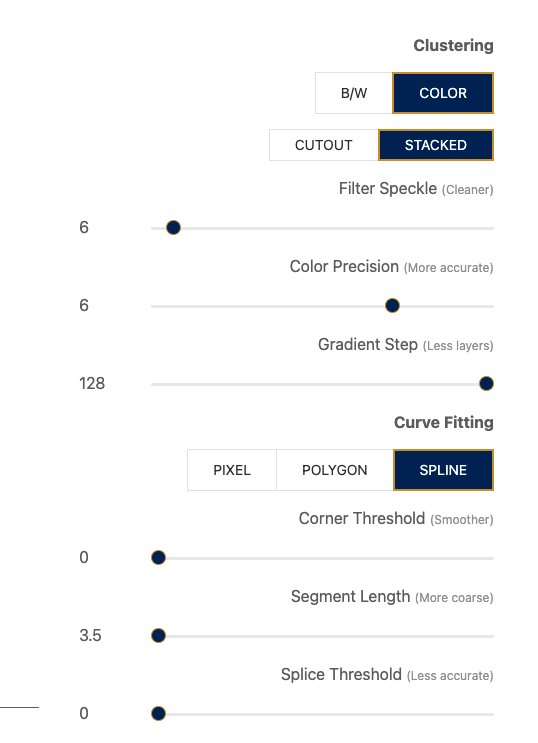

# Image to Python turtle script

to [https://www.visioncortex.org/vtracer/](https://www.visioncortex.org/vtracer/) to convert an image to svg

setting could like this: 

Install:

`pip install svg2turtle`

`svg2turtle downloaded-svg.svg`

will generate `svg.py`

# svg-to-turtle
Creating a turtle path using an svg

Original creator: https://www.reddit.com/r/Python/comments/fohqxy/made_a_program_that_reads_svg_files_and_draws_it/ - more complicated, uses sprites and requires svg file to be in a specific format
